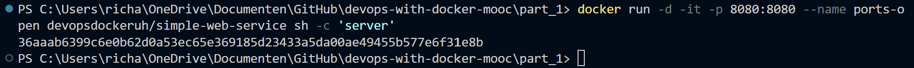
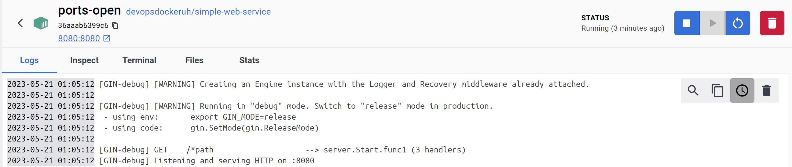

# Exercise 1.10: Ports Open 

## Command
The following command was ran to make the log file for this exercise:
``docker run -d -it -p 8080:8080 --name ports-open devopsdockeruh/simple-web-service sh -c 'server'``

This resulted in the following output when enterring the text file:

