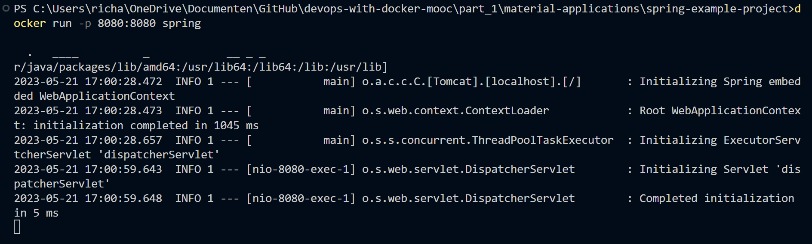

# Exercise 1.11: Spring

## spring.base file

First I needed to copy the repository with: ``git clone https://github.com/docker-hy/material-applications.git`` before continue with the ``spring.base`` script. After that, the ``spring.base`` file is put in the path: ``part_1\material-applications\simple-web-service``. The ``spring.base`` dockerfile consists of the following commands:

``# We need Java 8``  
``FROM openjdk:8``  
``EXPOSE 8080``  
``WORKDIR /usr/src/app``  
``COPY . .``  
``# Could not find mvnw package, so needed to apply the code below to run it``  
``RUN apt-get update && apt-get install -y dos2unix && find . -type f -print0 | xargs -0 dos2unix``  
``RUN ./mvnw package``  
``CMD ["java", "-jar", "./target/docker-example-1.1.3.jar"]``

Then the ``spring.base`` script was run with the command: ``docker build . -f spring.base -t spring``:

After the ``spring.base`` file was ran, then it was followed up with the command ``docker run -p 8080:8080 spring``:

When going to ``localhost:8080/press`` and press the "Press here" button, it gave the message "Success":

