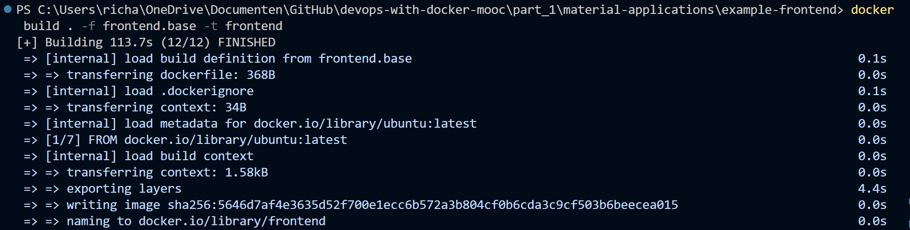
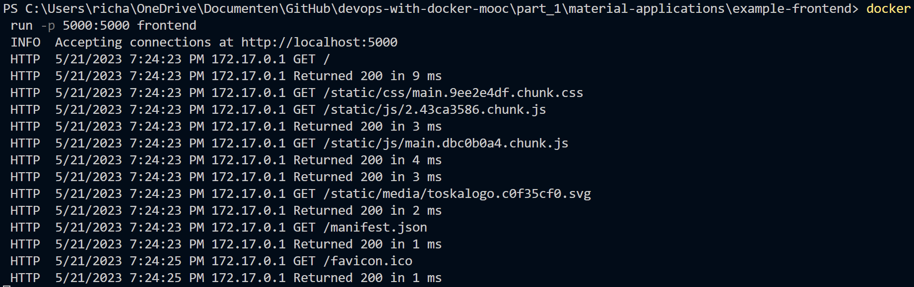
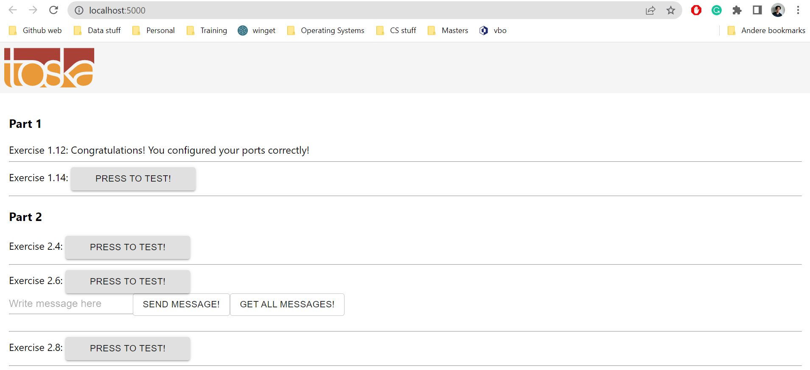

# Exercise 1.12: Hello, Frontend!

## frontend.base file

Since we have already copied the repository during the previous exercise, we can move the ``frontend.base`` to: ``part_1\material-applications\example-frontend``. The ``frontend.base`` dockerfile consists of the following commands:

``FROM ubuntu:latest`` <br/>
``EXPOSE 5000`` <br/>
``WORKDIR /usr/src/app`` <br/>
``COPY . .`` <br/>
``RUN apt-get update`` <br/>
``RUN apt-get install -y curl && curl -sL https://deb.nodesource.com/setup_14.x | bash`` <br/>
``RUN apt-get install -y nodejs`` <br/>
``RUN npm install && npm run build && npm install -g serve`` <br/>
``CMD ["serve", "-s", "-l", "5000", "build"]``

Then the ```frontend.base`` script was run with the command: ``docker build . -f frontend.base -t frontend``:



After the ``frontend.base`` file was ran, then it was followed up with the command ``docker run -p 5000:5000 frontend``:



When going to ```localhost:5000`` and check the output for "Exercise 1.12", it gave the message "Congratulations! You configured your ports correctly!":

