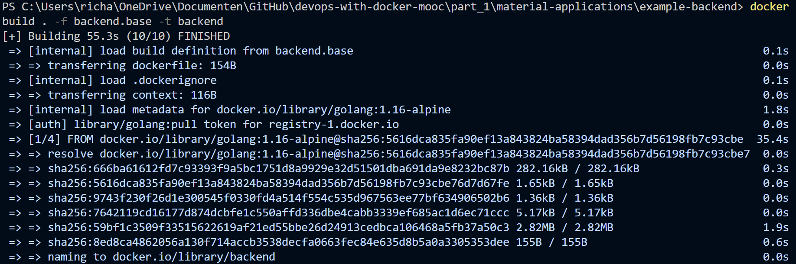
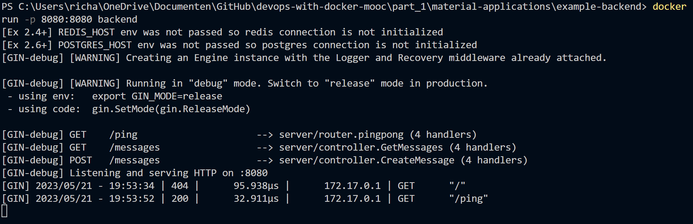

# Exercise 1.13: Hello, BAckend!

## backend.base file

Since we have already copied the repository during the previous exercise, we can move the ``backend.base`` to: ``part_1\material-applications\example-backend``. The ``backend.base`` dockerfile consists of the following commands:

``FROM golang:1.16-alpine`` <br/>
``EXPOSE 8080`` <br/>
``WORKDIR /usr/src/app`` <br/>
``COPY . .`` <br/>
``RUN go build`` <br/>
``CMD ["./server"]``

Then the ```backend.base`` script was run with the command: ``docker build . -f backend.base -t backend``:



After the ``backend.base`` file was ran, then it was followed up with the command ``docker run -p 8080:8080 backend``:



When going to ```localhost:8080/ping`` and check the output, it gave the message "pong":

