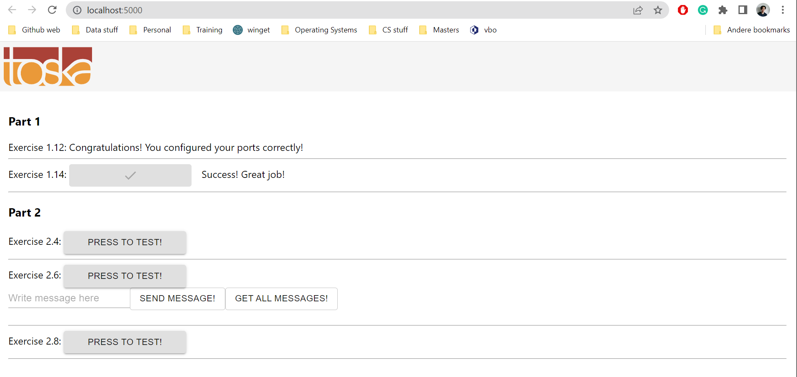

# Exercise 1.13: Environment

## backend.base & frontend.base file

Since we have already copied the repository during the previous exercise, we can move the ``backend.base`` to: ``part_1\material-applications\example-backend`` and ``frontend.base`` to ``part_1\material-applications\example-frontend``. The ``backend.base`` dockerfile is changed in comparison to the last exercise, since I stumbled upon an error (``panic: bad origin: origins must contain '*' or include http://,https://``). So it consists of the following commands:

``FROM ubuntu:latest``  
``COPY . .``  
``RUN apt-get update && apt-get install -y wget gcc && rm -rf /usr/local/go && wget -c https://golang.org/dl/go1.16.15.linux-amd64.tar.gz && tar -C /usr/local -xzf go1.16.15.linux-amd64.tar.gz``  
``ENV PATH /usr/local/go/bin:$PATH``  
``ENV REQUEST_ORIGIN http://localhost:5000``  
``RUN go build``  
``RUN go test``  
``CMD ./server``  
``EXPOSE 8080``

Same goes for the ``frontend.base`` dockerfile. This resulted in the following file: 

``FROM ubuntu:latest``  
``WORKDIR /usr/src/app``  
``EXPOSE 5000``  
``ENV REACT_APP_BACKEND_URL=http://localhost:8080``  
``RUN apt-get update``  
``RUN apt-get install -y curl``  
``RUN curl -sL https://deb.nodesource.com/setup_16.x | bash``  
``RUN apt install -y nodejs``  
``COPY . .``  
``RUN npm install``  
``RUN npm run build``  
``RUN npm install -g serve``  
``CMD ["serve", "-s", "-l", "5000", "build"]``

Then the ``backend.base`` scripts were run with the command: ``docker build . -f backend.base -t backend``. Whereas the ``frontend.base`` script was ran with ``docker build . -f frontend.base -t frontend``. Both were ran in their respective environments. 

After the ``backend.base`` and ``frontend.base`` dockerfiles were ran, then it was followed up with the command ``docker run -p 8080:8080 backend`` and ``docker run -p 5000:5000 frontend``. When going to ``localhost:5000`` and check the output, it gave the message "Success! Great job!" for Exercise 1.14:

