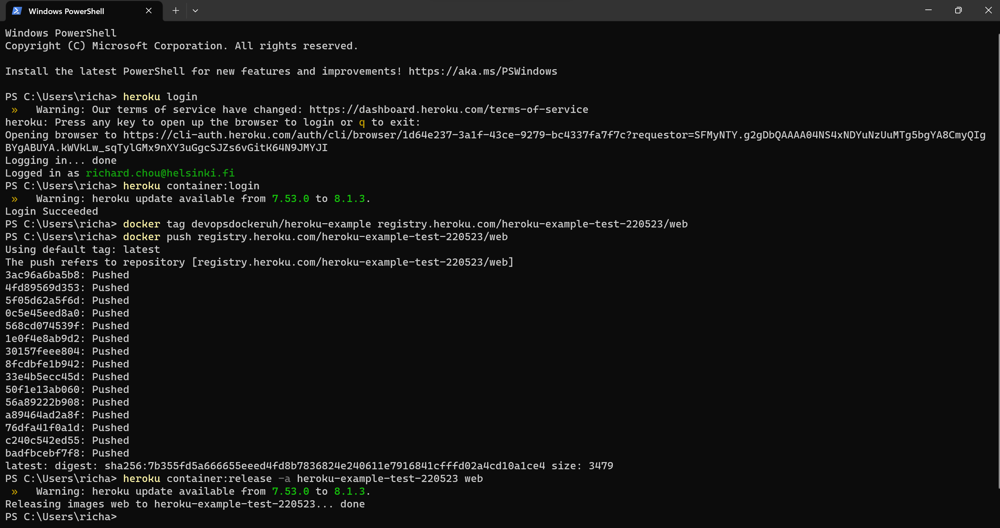

# Exercise 1.16: Cloud Deployment

## Heroku-Example

The Heroku-example was used from ``devopsdockeruh/heroku-example``: [https://hub.docker.com/r/devopsdockeruh/heroku-example]. After pulling it via Docker using ``docker pull devopsdockeruh/heroku-example``, the following commands were ran to have it published in Heroku:

This resulted that the deployment was successful and it is now accessible via: [https://heroku-example-test-220523.herokuapp.com/presses/new].