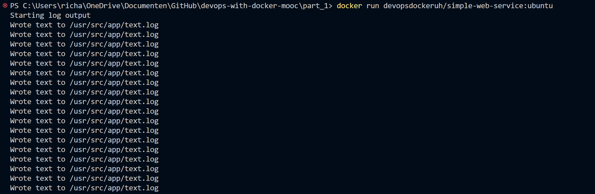
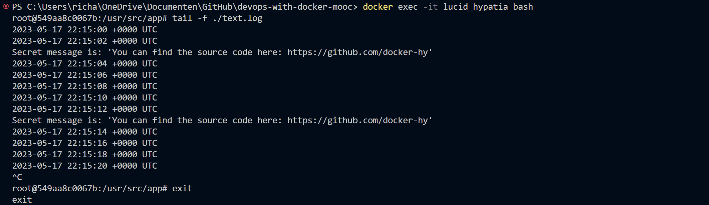
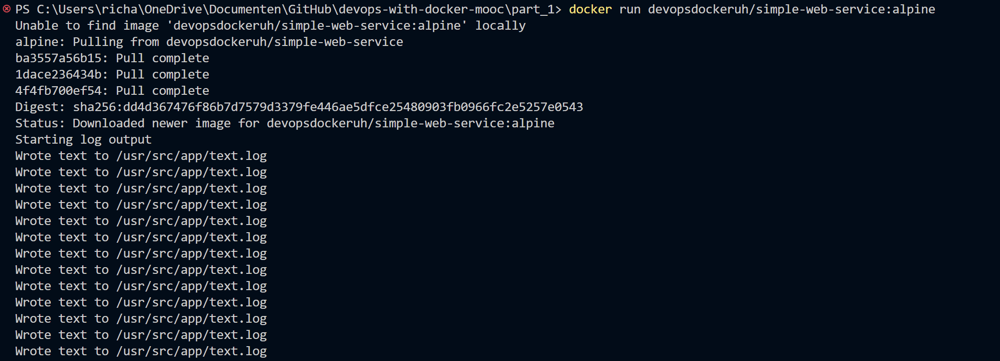
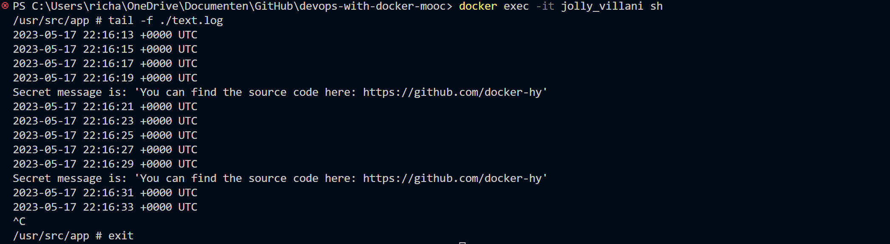

# Exercise 1.5: Sizes of Images

## devopsdockeruh/simple-web-service:ubuntu
### Part 1: Run image

### Part 2: Output bash 

## devopsdockeruh/simple-web-service:alpine
### Part 1: Run image

### Part 2: Output shell  

Both output the same secret message, which is: "Secret message is: 'You can find the source code here: [https://github.com/docker-hy](https://github.com/docker-hy)".