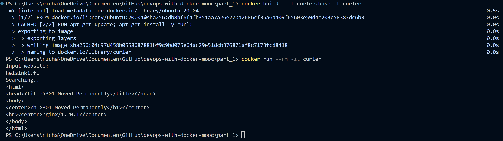

# Exercise 1.7: Image for Script

## curler.base file

``FROM ubuntu:20.04``  
``RUN apt-get update; apt-get install -y curl;``  
``CMD echo 'Input website:'; read website; echo 'Searching..'; sleep 1; curl http://$website;``

## curler output

