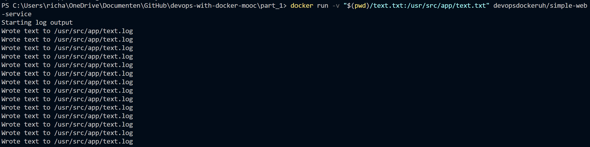
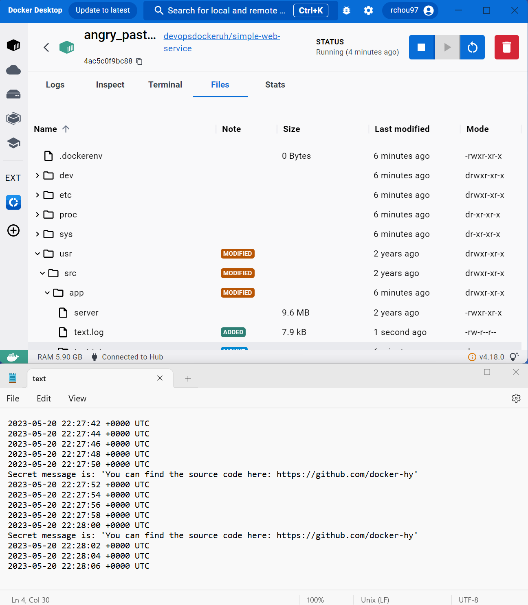

# Exercise 1.9: Volumes

## Command
The following command was ran to make the log file for this exercise: 
``docker run -v "$(pwd)/text.txt:/usr/src/app.txt" devopsdockeruh/simple-web-service``

This resulted in the following output when enterring the text file: 

