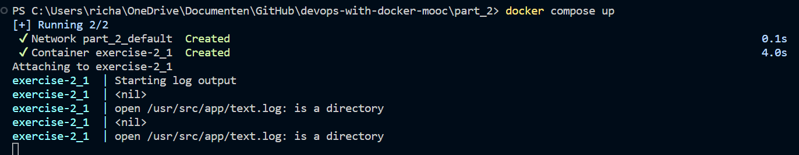

# Exercise 2.1

## Docker Compose file

The ``docker-compose.yml`` file is build up as follows:

```yml
version: '3.8'

services:
    simple-web:
        image: devopsdockeruh/simple-web-service:alpine
        volumes:
            - ./text.log:/usr/src/app/text.log
        container_name: exercise-2_1 
```

Then the ``docker compose up`` command was run:


