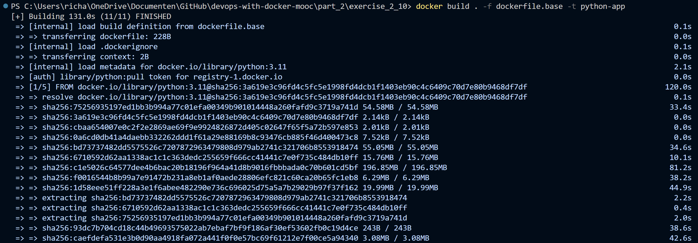
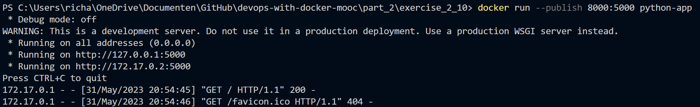
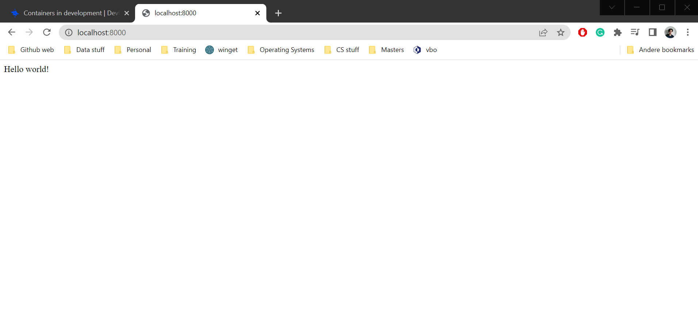

# Exercise 2.11
For this exercise, a small "hello, world" app has been used with Docker. In this case, the following steps has been taken.

## Part 1: Setup environemnt
Within Git Bash, the following commands have been run to setup the Python environment with Flask as backend for running the application: 

```git
python3 -m venv .venv
source .venv/bin/activate
(.venv) python3 -m pip install Flask
(.venv) python3 -m pip freeze > requirements.txt
(.venv) touch app.py
```

## Part 2: Build up ``app.py`` 
Within the app, the script is build up as follows:

```python
from flask import Flask

app = Flask(__name__)

@app.route('/')
def hello_world():
    return 'Hello world!'
```
## Part 3: Setup dockerfile
The Dockerfile is build as follows:

```base
# Python version
FROM python:3.11

# Setup working directory for the application
WORKDIR /app

# Copy the requirements.txt file to the working directory
COPY requirements.txt requirements.txt

# Run the requirements.txt file with pip (installing Flask)
RUN pip3 install -r requirements.txt

# Copy the files to the image 
COPY . .

# Command for running the image
CMD ["python3", "-m" , "flask", "run", "--host=0.0.0.0"]
```

## Part 4: Build the Docker image 
The following command is used to build the docker image: ``docker build . -f dockerfile.base -t python-app``. This gave the following output:



## Part 5: Running the container 
Now that we have created the container, the following command can be run to run the container: ``docker run --publish 8000:5000 python-app``. Within this command, we specify the host port and container port with the ``--public`` flag (aka ``-p``). This gave the following output:



Now that we know that the app can run, we can head to the ``localhost:8000``. Lets see if it works. In this case it works! See below for the output: 

