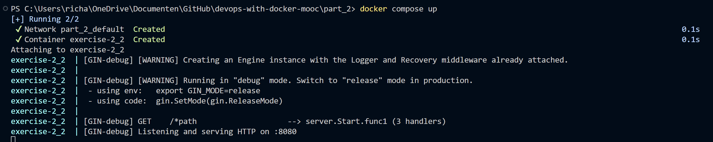

# Exercise 2.2

## Docker Compose file

In comparison to the previous exercise, the ``docker-compose.yml`` file does not need much adjustments. In this case, we will add the ports where the file will run. The file is build up as follows:

```yml
version: '3.8'

services: 
    simple-web: 
        image: devopsdockeruh/simple-web-service:alpine
        ports:
            - 8080:8080 
        command: server
        container_name: exercise-2_2
```

Then the ``docker compose up`` command was run:


