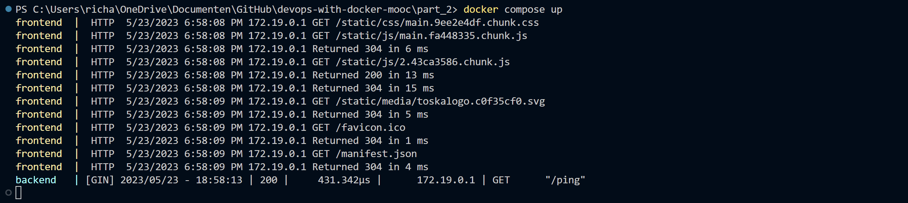

# Exercise 2.3

## Docker Compose file

We are reusing the scripts again that was constructed in part 1. In this case the images ``backend.base`` and ``frontend.base``.  

As addition to exercise 2.3, we will add the redis image where the files will be running on. It resulted in the following:

```yml
version: '3.8'

services: 
    backend-base: 
        image: backend
        ports:
            - 8080:8080
        container_name: backend

    frontend-base: 
        image: frontend
        ports:
            - 5000:5000
        container_name: frontend
```

Then the ``docker compose up`` command was run, which resulted in the following output:


