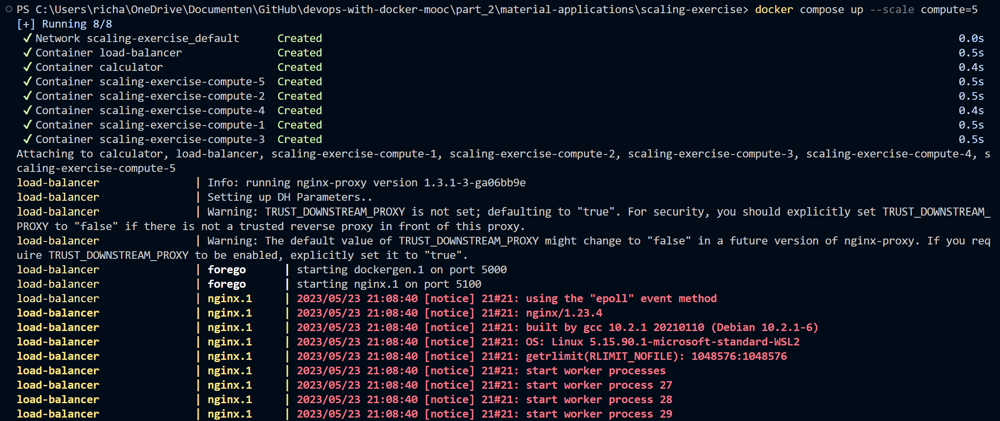

# Exercise 2.5

## Docker Compose command

The ``docker-compose.yml`` file has not changed. It was scaled up when running the command ``docker compose up --scale compute=5``. This resulted in the following:  

