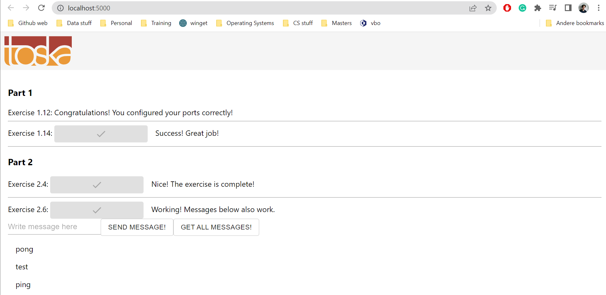
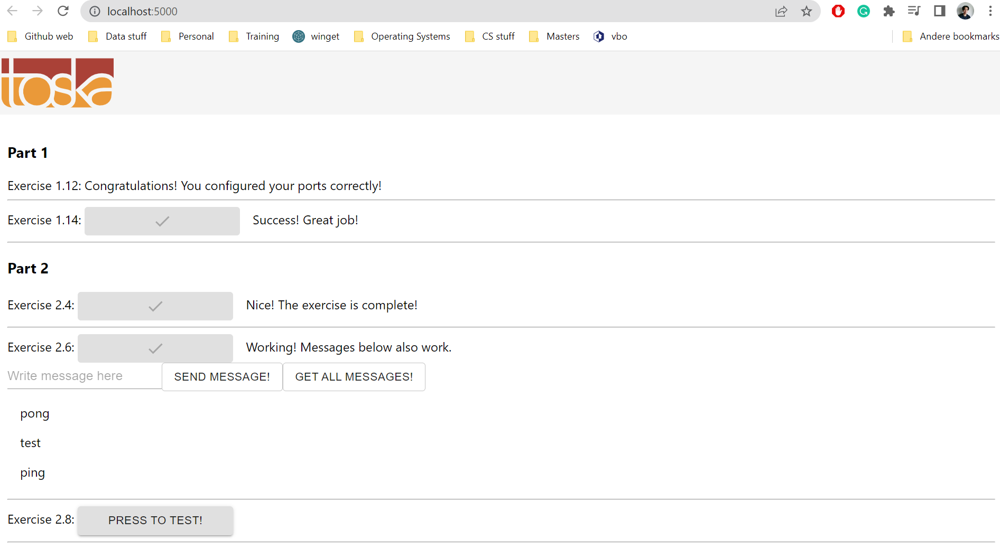

# Exercise 2.7

## Docker Compose file

We are reusing the scripts again that was constructed in part 1. In this case the images ``backend.base`` and ``frontend.base``.  

In this case, we will add the volume and the ``depends_on`` to the ``backend-base`` service. It resulted in the following:

```yml
version: '3.8'

services: 
    backend-base: 
        image: backend
        ports:
            - 8080:8080
        environment:
            REDIS_HOST: redis-base
            POSTGRES_HOST: database
            POSTGRES_USER: postgres
            POSTGRES_PASSWORD: postgres
            POSTGRES_DATABASE: postgres
        depends_on:
            - database
            - redis-base
        container_name: backend

    frontend-base: 
        image: frontend
        ports:
            - 5000:5000
        container_name: frontend

    redis-base:
        image: redis 
        container_name: redis-base 

    database:
        image: postgres:alpine
        restart: unless-stopped 
        environment: 
            POSTGRES_PASSWORD: postgres
        container_name: postgres
        volumes: 
            - ./database:/ex27
```

Then the ``docker compose up`` command was run, which resulted in the following outputs:


A few messages have been saved, which can be seen here:



Run ``docker compose down`` and then ``docker compose up``. See if the messages are available after refreshing the browser:


Which is still the case:



Then ``docker compose down`` was run and the command ``docker volume rm ex27`` was run to remove the volume folder:


Finally, ``docker compose up`` was run and a check was done if the data is gone (which was the case):

