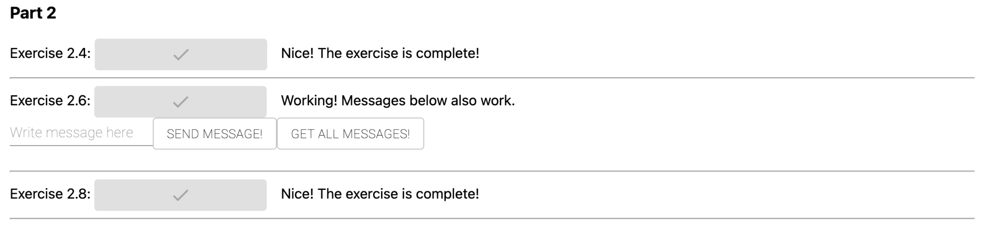

# Exercise 2.9

## Docker Compose file

We are reusing the scripts again that was constructed in part 1 and the exercises within part 2. In this case the images ``backend.base`` and ``frontend.base``.  

Changes that are made within the ``docker-compose.yml`` file are the following:

```yml
version: "3.8"

services:
  db:
    image: postgres:13
    restart: unless-stopped
    environment:
      POSTGRES_PASSWORD: example
      POSTGRES_USER: user
      POSTGRES_DATABASE: db
    volumes:
      - ./data:/var/lib/postgresql/data
    container_name: database

  nginx:
    image: nginx
    ports:
      - 80:80
    volumes:
      - ./nginx.conf:/part_2/nginx.conf
    container_name: nginx

  backend:
    image: backend
    build: ./example-backend
    ports:
      - 8080:8080
    environment:
      REDIS_HOST: redis
      POSTGRES_HOST: db
      POSTGRES_USER: user
      POSTGRES_PASSWORD: example
      POSTGRESS_DATABASE: db
      REQUEST_ORIGIN: http://localhost:80
    depends_on:
      - db
      - redis
    container_name: backend

  frontend:
    image: frontend
    build: ./example-frontend
    ports:
      - 5000:5000
    environment: 
        REACT_APP_BACKEND_URL: http://localhost:80
    container_name: frontend

  redis:
    image: redis
    container_name: redis
```

This resulted in the following output to work:


